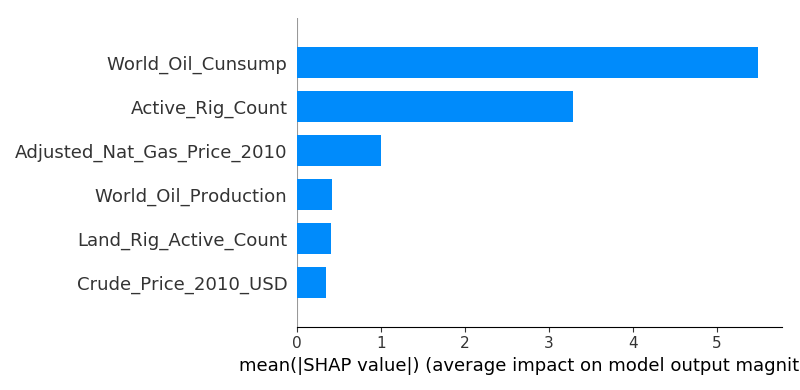
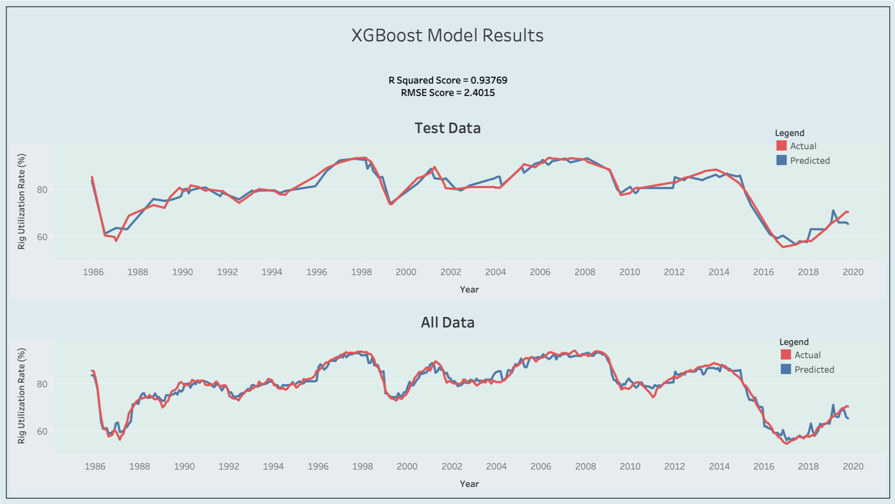
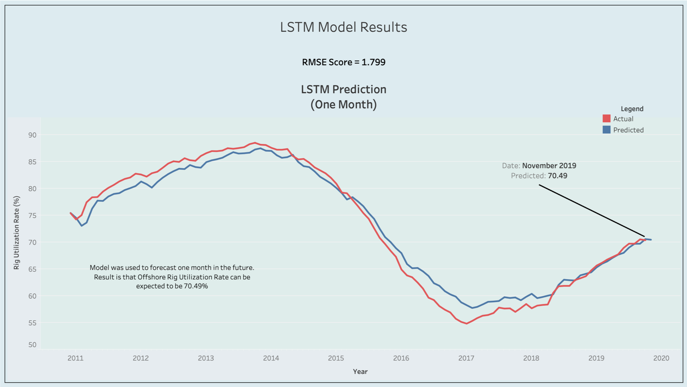

# Prediction of Off-Shore Rig Utilization Rate 
## Developers
* Han Yang
* John Hawkins
* Shilpa Muralidhar
* Michael Harper
## Background
The price of contracting a drilling rig is highly affected by the rig utilization rate. An offshore drilling rig company is considering making a bid on a tender that has been received. The rig is currently in a ‘warm stacked’ mode and costs $15,000 per day to operate. In order to put it back to work, an additional $80 million is needed plus an operational cost of $150,000 per day. What day rate should be charged for a 4-year term to avoid underbidding the market?
## Objectives
1. Identify the potential factors impacting global off-shore rig utilization rate
2. Utilize machine learning algorithm to establish a model to predict global off-shore rig utilization rate.
3. Validate the model by comparing prediction vs actual.
## Tools
* Python
* Tableau
## Results
1. Feature Importance (SHAP Values)

2. Xgboost Model

3. Long Short-term Memory (LSTM) Model

## Conclusion
1. The most influential factor is world oil consumption followed by active rig count and natural gas price.
2. Although both Xgboost and LSTM models did a good job on predicting, LSTM model is preferred to solve the problem, since it could predict for the next month.
## Tableau Public Website
https://tabsoft.co/366KwAm

